# osTicket Lab

## Overview
Deployed a fully functional ticketing system using osTicket on an Ubuntu 22.04 Linux VM hosted in VirtualBox.

## Technologies Used
- Ubuntu Server 22.04
- Apache2 Web Server
- MySQL 8.0
- PHP 8.2
- osTicket v1.18.3

## What I Did
- Deployed LAMP stack on Ubuntu Server VM
- Configured MySQL database and user permissions
- Installed and configured osTicket v1.18.3
- Created departments: IT Support and Network Team
- Created agent accounts and assigned to departments
- Submitted and resolved help desk tickets including:
  - Account lockout investigation and resolution
  - Password reset request
  - Software installation with permissions issue

## Skills Demonstrated
- Linux server administration
- Web server configuration (Apache)
- Database management (MySQL)
- Help desk ticketing workflow
- User and department management

## Screenshots

### Apache Web Server Running
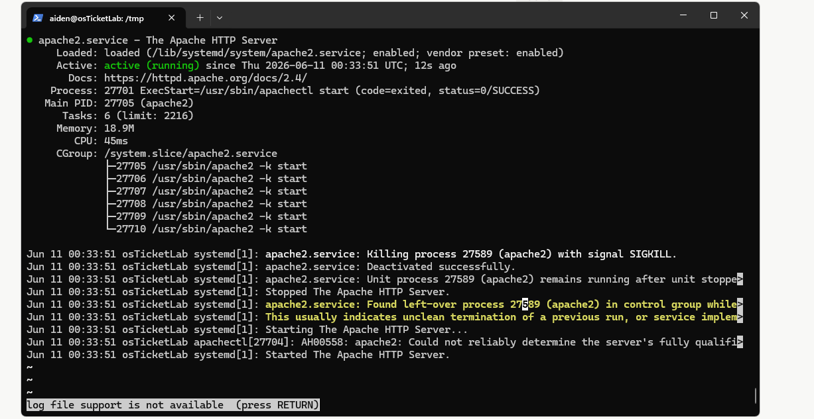

### osTicket Prerequisites
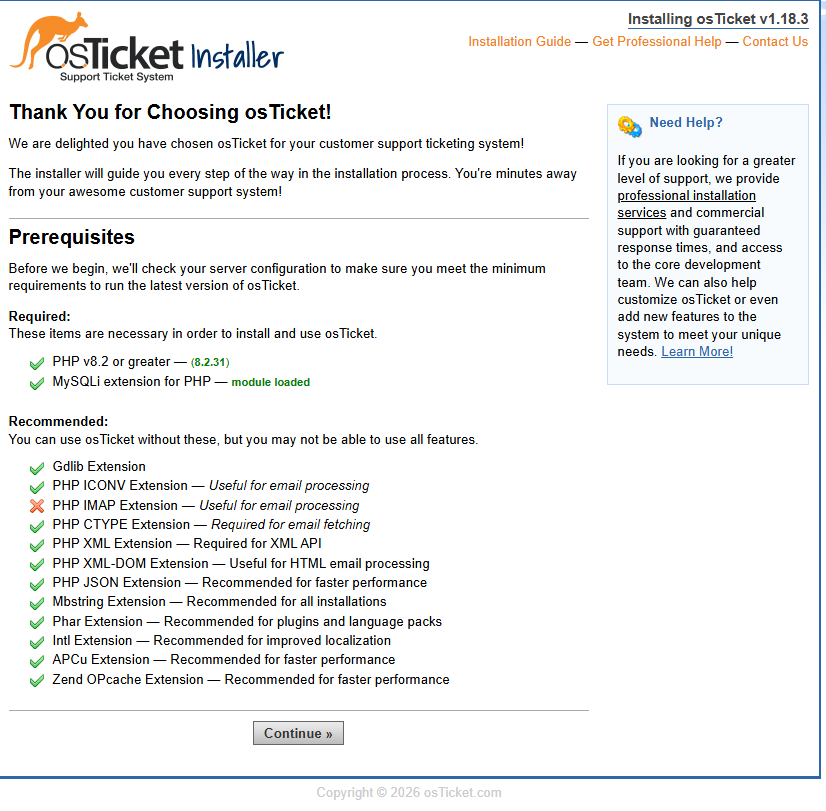

### Installation Complete
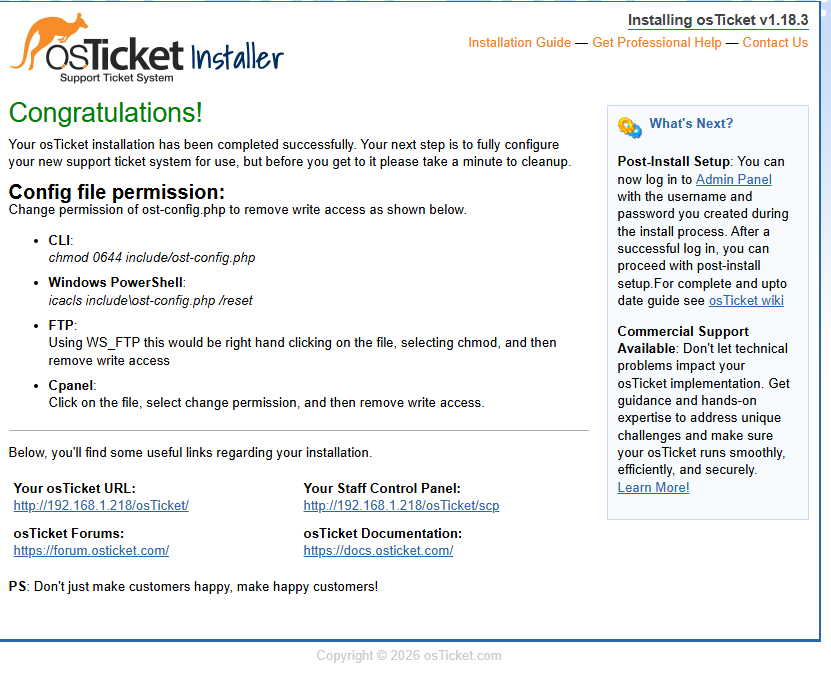

### Admin Panel
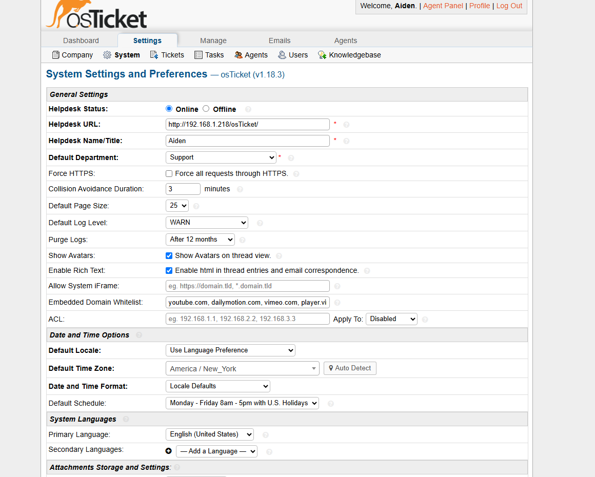

### Departments
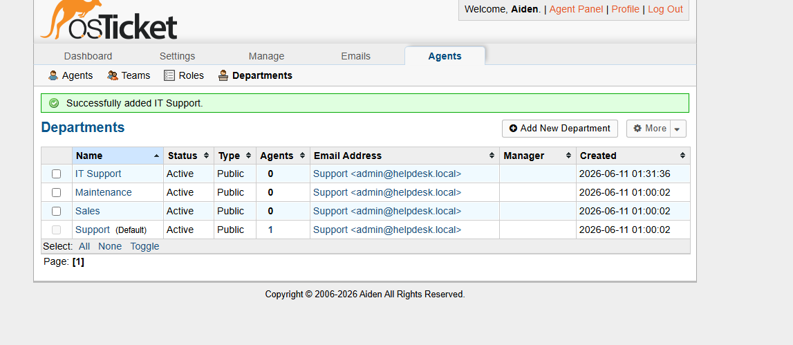

### Agents
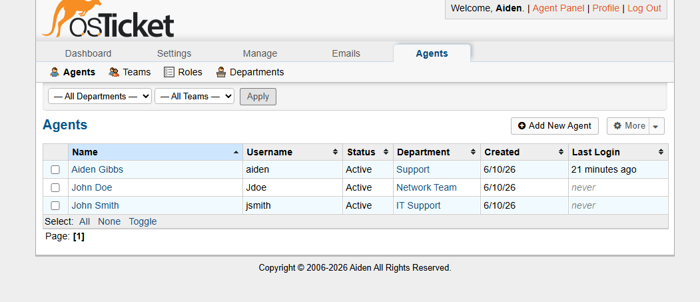

### Ticket Submitted by End User
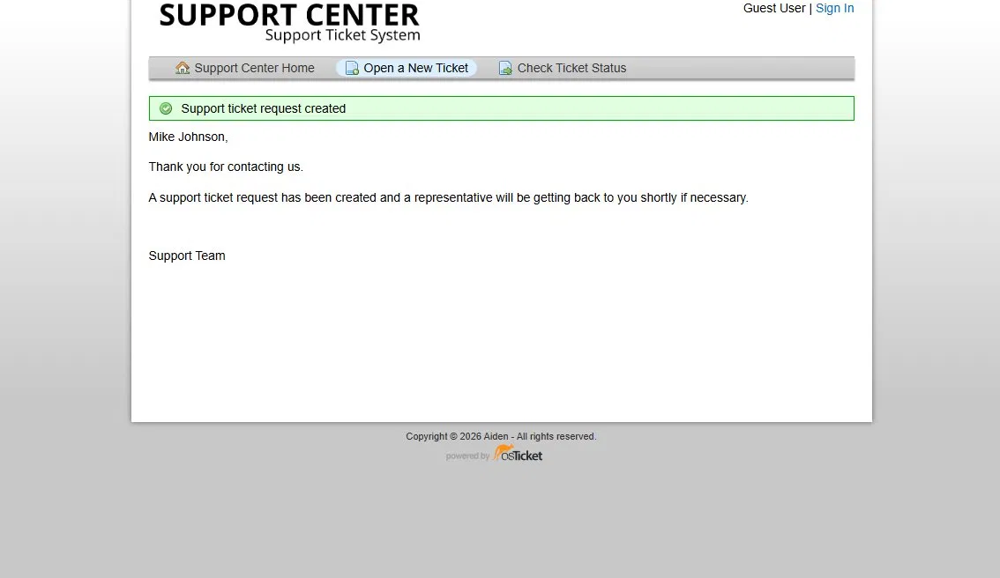

### Open Ticket Queue
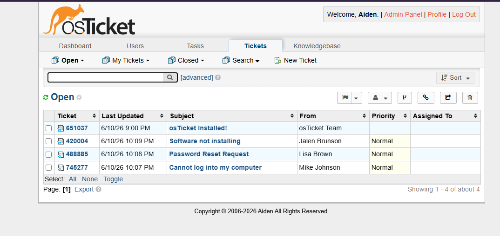

### Resolved - Account Lockout
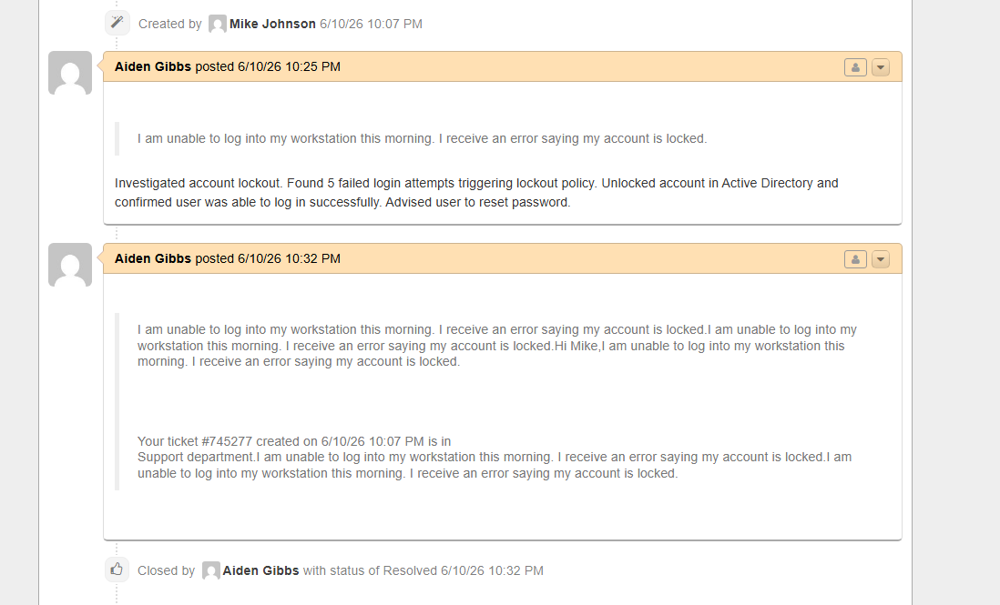

### Resolved - Software Installation
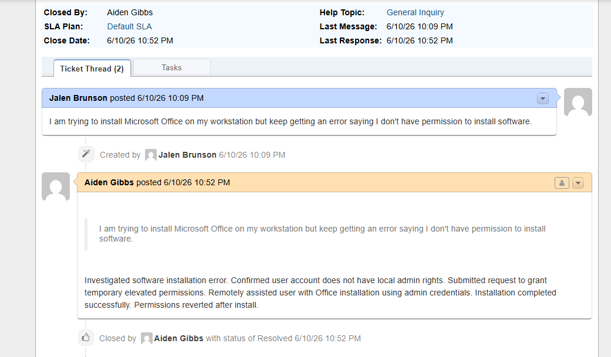

### All Tickets Closed
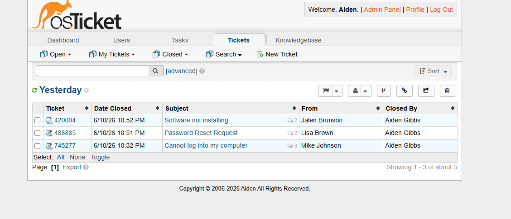
